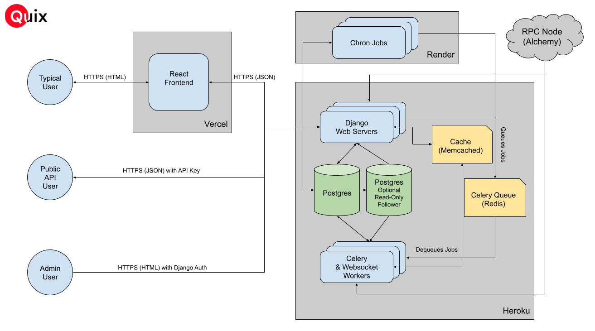

# What is Quix?

Quix was built in 2021-2022 as the NFT marketplace for Optimism. It is a web app optimized for both desktop and mobile. 
It supports the following important features:

* NFT Indexer + Collection & Profile pages
  * Quix indexes all NFTs (ERC721s and ERC1155s) deployed on Optimism
  * Quix indexes some layer 1 NFTs so that users can bridge them
  * Quix displays a collection page for any collection deployed on Optimism
  * Creators can set descriptions, royalties, and links for NFT collections
  * Collectors can view all Optimism NFTs, bridgable ETH NFTs, and NFT activity on profiles

* NFT Exchange
	* Collectors can list NFTs in ETH or $OP token
	* Collectors can create offers for NFTs in ETH or $OP token
	* Collectors can purchase listed NFTs individually or in batch (via our cart)

* Rewards Program
	* Collectors can receive $OP tokens when purchasing NFTs
  * Quix admins can create rewards campaigns for Quix partners
  * Quix partners can turn campaigns on and off

* Launchpad
  * Creators can launch a new NFT collection without writing any code
  * Creators can specify wallet addresses for a whitelist mint
  * Collectors can mint easily via the trusted Quix website

* Public API
	* Developers can fetch various kinds of data from the backend. See more [here](https://quixotic.readme.io/reference/api-overview)

* NFT Bridge Frontend
	* Holders of ETH NFTs can bridge them to Optimism (and bridge them back)
	* Collection pages display unified collection tokens and attributes for partially bridged collections
	* Note that the NFT bridge smart contracts are maintained by Optimism.

## Implementation

Quix has a Next.js / React [frontend](https://github.com/quixotic-dev/frontend) deployed on Vercel and a Django backend deployed on Heroku. We make extensive use of
the [Django REST framework](https://www.django-rest-framework.org/) and the Django ORM. The backend has the following 
pieces of infrastructure:

* Web servers - These synchronously respond to web requests. They scale horizontally.
* PostgreSQL Database - A large SQL database that stores all important data in the app. All services need to connect to 
the DB. Optionally, we'd recommend adding a postgres follower to help with performance. 
* [Django Cache](https://docs.djangoproject.com/en/4.1/topics/cache/) (Memcached) - A cache used by web servers to serve requests more quickly. In a production setting, this 
cache is necessary or web servers and the database will get overwhelmed.
* [Celery Queue](https://docs.celeryq.dev/en/stable/) (Redis) - Celery is the queueing system used for asynchronous work. It's helpful for calculating stats,
pulling in tokens from new collections and much more.
* Chron Jobs - Scheduled task that must be performed to keep the app up-to-date with latest on-chain data. These can be 
run anywhere you'd like (Heroku, Render, AWS).

## Apps
The Quix backend is a Django app deployed on Heroku (although it can also be deployed on AWS without too much trouble).
The codebase itself is somewhat flexible, so that we can use environmental variables to specify different versions of 
the app. In our setup, we're running the following versions of the app:

* **quix-opt-mainnet** - The main Django backend servicing web request for [qx.app](https://qx.app).
* **quix-opt-goerli** - The Django backend servicing web request for the testnet version of our site -
[testnet.qx.app](https://testnet.qx.app). This is important for NFT creators, but it's 
infrastructure is more lightweight than the main backend.
* **quix-mainnet-api** - The Django backend servicing requests for our [API](https://quixotic.readme.io/reference/api-overview).
This is used by partners to get NFT data, collection stats, and sales data. 

It's also recommended to run a development version of the above apps.

In addition to the above apps, we've found it useful to run [Flower](https://flower.readthedocs.io/en/latest/), the 
UI for our queuing system [Celery](https://docs.celeryq.dev/en/stable/).

## Environmental Variables

### Standard Env Vars
These are the env vars you need to include in web servers, celery workers, and chron jobs.

`ALCHEMY_API_KEY` - An API key for alchemy.com. Required to pull all blockchain data.

`AWS_ACCESS_KEY` - Access Key for S3 bucket. Required to pull in NFT media.

`AWS_SECRET_KEY` - Secret Key for S3 bucket. Required to pull in NFT media.

`BOUNCER_PRIVATE_KEY` - An Ethereum private key to control whitelist minting through the Quix launchpad. It's critical 
to keep this key secret.

`BRIDGE_DEPLOYER_KEY` - An Ethereum private key to deploy Erc721 contracts used for bridging layer 1 NFTs. This address 
needs to be funded to pay gas fees to deploy a new OptimismMintableERC721 contract for each L1 collection that will be 
bridged.

`BRIDGE_DEPLOYER_ADDRESS` - The public Ethereum address corresponding to the private key at `BRIDGE_DEPLOYER_KEY`. 

`USE_CELERY_PROCESS_TXN` - When set to `True` or `1`, the backend will process new Erc721 or Erc1155 transfers 
asynchronously using celery workers rather than synchronously with web servers or chron jobs. 

`USE_CELERY` - When set to `True` or `1`, the backend will use celery workers wherever it can to distribute work. 
Examples of work that should use celery include calculating stats and pulling in tokens from new collections. 

`DATABASE_URL` - A database connection string to the main postgreSQL database. In Heroku, this is usually automatically 
set. 

`DATABASE_CONNECTION_POOL_URL` - A database connection string to an instance of `pgbouncer` to improve performance of 
database connections. See more [here](https://devcenter.heroku.com/articles/postgres-connection-pooling).

`MAILGUN_SMTP_LOGIN` - Standard SMTP login used by Django for internal error messages. 

`MAILGUN_SMTP_PASSWORD` - Password corresponding to `MAILGUN_SMTP_LOGIN`.

`MEMCACHEDCLOUD_SERVERS` - Connection URL for a memcached instance which powers the Django cache. In production 
settings, the Django cache is critical for performance.

`MEMCACHEDCLOUD_PASSWORD` - Password corresponding to `MEMCACHEDCLOUD_SERVERS`

`MEMCACHEDCLOUD_USERNAME` - Username corresponding to `MEMCACHEDCLOUD_SERVERS`

`NETWORK` - The blockchain network the backend should connect to. Set to either `opt-mainnet` or `opt-goerli`. The 
naming scheme matches the naming patterns for the Alchemy API. 

`REDIS_URL` - Connection URL for a Redis instance which powers the Celery queue. The Redis serves as both a backend 
and broker for our Celery queue. See more [here](https://docs.celeryq.dev/en/stable/getting-started/backends-and-brokers/index.html#redis).

`SECRET_KEY` - The [Django secret key](https://docs.djangoproject.com/en/4.1/ref/settings/#secret-key) 

`SENDGRID_API_KEY` - Create at sendgrid.com. Used for sending emails to users about purchases, offers, and bridging.

### Env vars for the public API
These are all the environmental variable you need to run the public API.

`DATABASE_URL` - The database connection string. Because this is a read-only service, you can connect this to the 
postgres follower if you have one. Otherwise connecting to the main database is fine.

`IS_EXTERNAL_API` - Should be set to `True` or `1`. 

`SECRET_KEY` - The [Django secret key](https://docs.djangoproject.com/en/4.1/ref/settings/#secret-key). 

`MAILGUN_SMTP_LOGIN` - Standard SMTP login used by Django for internal error messages. 

`MAILGUN_SMTP_PASSWORD` - Password corresponding to `MAILGUN_SMTP_LOGIN`.

## Chron Jobs
Several backend processes are required to keep all data up-to-date. For any data tracked on-chain (NFT 
transfers, $OP reward distributes, updates to tokenURIs for NFT collections), we usually need to run a chron job to pick
that up. For important data (NFT transfers), We are running the following jobs in production:

| Command                                         | Schedule         | Description                                                                                           |
|-------------------------------------------------|------------------|-------------------------------------------------------------------------------------------------------|
| `python manage.py refresh_collections_stats`    | Every 10 minutes | Refreshes trade volume, floor price, and percent listed for a collection                              |
| `python manage.py pull_eth_price`               | Every 10 minutes | Updates our database with the most recent ETH price. Useful for conversions                           |
| `python manage.py refresh_collections`          | Every hour       | Refreshes collections from blockchain state. For example, refreshes totalSupply.                      |
| `python manage.py refresh_collections_metadata` | Every hour       | Refreshes collection metadata. Useful if the tokenURI changes during an NFT reveal.                   |
| `python manage.py send_bridge_notifications`    | Every hour       | Sends emails to users if they need to finish bridging an NFT.                                         |
| `python manage.py refresh_campaigns`            | Every 10 minutes | Pulls blockchain data about $OP rewards campaigns into our DB.                                        |
| `python manage.py pull_new_transfers`           | Every 10 minutes | Pulls all Erc721 transfers for all L2 NFTs. Meant to catch transfers the websocket missed.            |
| `python manage.py pull_new_tokens`              | Every 10 minutes | Pull newly created tokens tokens for all L2 contracts. Meant to catch transfers the websocket missed. |
| `python manage.py pull_new_collections`         | Every 10 minutes | Pull all newly created NFT contracts. Meant to catch transfers the websocket missed.                  |
| `python manage.py pull_new_transfers_erc721`    | Every 10 minutes | Pulls Erc721 transfers for tracked L1 tokens. Meant to catch transfers the websocket missed.          |
| `python manage.py pull_new_transfers_erc1155`   | Every 10 minutes | Pulls Erc155s transfers for tracked L1 tokens. Meant to catch transfers the websocket missed.         |
| `python manage.py refresh_orders_short`         | Every 10 minutes | Refreshes orders (offers & listings). This removes listings and offers that are no longer valid.      |

These should have access to the same environmental variables as **quix-opt-mainnet**.

## Known issues

If running Quix in a production setting, you should be aware of the known issues [here](docs/KnownIssues.md).

